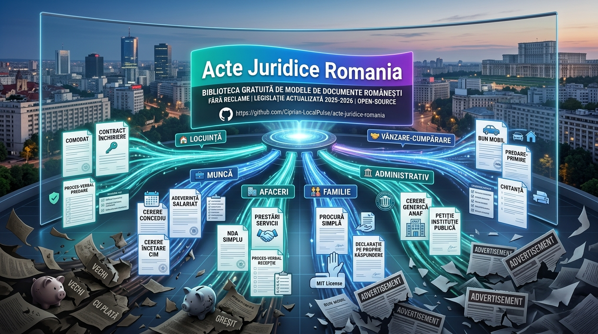

# Acte Juridice Romania

<p align="center">
  
</p>

<p align="center">
  <a href="./LICENSE"></a>
  <a href="./docs/surse-oficiale.md"></a>
  <a href="./templates/INDEX.md"></a>
  <a href="./DONATE.md"></a>
</p>

<p align="center">
  
  
  
  
</p>

> Biblioteca gratuita de modele pentru documente juridice si acte uzuale din Romania: locuinta, munca, afaceri, familie, administrativ, consumatori si vanzare-cumparare.

## Important

Aceste documente sunt modele educationale si puncte de pornire. Nu constituie consultanta juridica, fiscala sau notariala si nu inlocuiesc verificarea cu un avocat, notar, consultant fiscal sau institutie competenta. Legislatia se poate schimba; verifica mereu sursele oficiale inainte de folosire.

## De ce exista

Internetul romanesc este plin de formulare vechi, pagini cu reclame agresive si modele platite pentru acte simple. Acest repository ofera un punct de start curat, gratuit, versionat si verificabil pentru oameni care vor sa inteleaga ce trebuie sa contina un document.

## Categorii

| Categorie | Documente incluse | Modele |
| --- | --- | --- |
| Locuinta | Inchiriere, comodat, notificari, garantie, inventar, utilitati | 10 |
| Munca | Concedii, demisie, telemunca, adeverinte, sesizari, pontaj | 11 |
| Afaceri | Servicii, NDA, colaborare, mentenanta, cesiune, oferte, notificari | 12 |
| Familie | Procuri, declaratii, gazduire, acord parental, imputerniciri | 7 |
| Administrativ | ANAF, petitii, Legea 544, ONRC, certificate, contestatii | 11 |
| Consumatori | Reclamatii, retur, garantie, comanda online, servicii | 6 |
| Vanzare-cumparare | Bun mobil, predare, chitanta, avans, rezolutiune | 7 |
| ----------------------- | ------------------------------------------------------------------------ | ------ |
| Succesiuni              | Testament, acceptare/renuntare succesiune, partaj, dezbatere notar       | 5      |
| Auto                    | Vanzare-cumparare, comodat, imputernicire, predare-primire vehicul       | 4      |
| Imobiliare              | Antecontract, promisiune vanzare, arvuna, notificare neexecutare         | 4      |
| Imprumuturi si garantii | Imprumut intre persoane fizice, recunoastere datorie, fidejusiune        | 3      |
| Firme si PFA            | Decizie asociat unic, hotarare AGA, comodat sediu, suspendare PFA        | 4      |
| GDPR si protectia datelor | Acces, stergere si opozitie la prelucrarea datelor personale           | 3      |
| Asociatie de proprietari | Cereri si contestatii privind cheltuielile comune                       | 2      |

Total: **89 de modele de documente**, plus ghiduri, surse oficiale, checklist-uri si fisiere de comunitate.

## Start rapid

1. Alege categoria din [`templates/`](./templates/).
2. Deschide [`templates/INDEX.md`](./templates/INDEX.md) sau [`docs/harta-situatii.md`](./docs/harta-situatii.md).
3. Copiaza modelul potrivit intr-un document nou.
4. Inlocuieste campurile marcate cu `[PARANTEZE]`.
5. Citeste checklist-ul si avertismentele din model.
6. Verifica sursele oficiale din [`docs/surse-oficiale.md`](./docs/surse-oficiale.md).

## Structura

```text
.
├─ templates/
│  ├─ administrativ/
│  ├─ afaceri/
│  ├─ consumatori/
│  ├─ familie/
│  ├─ locuinta/
│  ├─ munca/
│  └─ vanzare-cumparare/
│  ├─ asociatie-proprietari/
│  ├─ auto/
│  ├─ firme-pfa/
│  ├─ gdpr-protectia-datelor/
│  ├─ imobiliare/
│  ├─ imprumuturi-si-garantii/
│  ├─ succesiuni/
```
├─ docs/
│  ├─ avertisment-juridic.md
│  ├─ categorii-si-riscuri.md
│  ├─ ghid-adaptare.md
│  ├─ harta-situatii.md
│  └─ surse-oficiale.md
├─ .github/
│  ├─ ISSUE_TEMPLATE/
│  └─ FUNDING.yml
└─ CONTRIBUTING.md
```

## Reguli de calitate

- Fiecare model trebuie sa aiba scop clar, campuri editabile si checklist.
- Nu copiem formulare proprietare sau continut platit.
- Nu promitem ca un model este potrivit pentru toate situatiile.
- Pastram linkuri catre surse oficiale acolo unde exista.
- Marcam documentele care necesita notar, avocat, ANAF, ITM sau alta institutie.

## Sustine proiectul

Daca repository-ul te-a ajutat, poti sustine cercetarea, actualizarea si organizarea documentelor:

<p align="center">
  <a href="./DONATE.md"></a>
  <a href="https://paypal.me/agentflowenterprise"></a>
</p>


### 🇪🇺 European Payment — SEPA / EUR


| Field | Details |
|-------|---------|
| **Recipient** | Ciprian Stefan Plesca |
| **IBAN** | `BE83 9679 1975 8915` |
| **SWIFT / BIC** | `TRWIBEB1XXX` |
| **Bank** | Wise, Rue du Trône 100, 3rd floor, Brussels, 1050, Belgium |

</div>

---

<div align="center">

### 🇬🇧 United Kingdom Payment — Faster Payments / GBP


| Field | Details |
|-------|---------|
| **Recipient** | Ciprian Stefan Plesca |
| **Account number** | `92055372` |
| **Sort code** | `23-14-70` |
| **IBAN** | `GB68 TRWI 2314 7092 0553 72` |
| **SWIFT / BIC** | `TRWIGB2LXXX` |
| **Bank** | Wise Payments Limited, 1st Floor, Worship Square, 65 Clifton Street, London, EC2A 4JE, United Kingdom |

</div>

---

<div align="center">

### 🇺🇸 United States Payment — ACH / Wire / USD


| Field | Details |
|-------|---------|
| **Recipient** | Ciprian Stefan Plesca |
| **Account type** | Checking |
| **Routing number** | `026073150` |
| **Account number** | `8314225367` |
| **SWIFT / BIC** | `CMFGUS33` |
| **Bank** | Community Federal Savings Bank, 89-16 Jamaica Ave, Woodhaven, NY 11421, United States |

</div>

---

<div align="center">

### 🇷🇴 Romanian Payment — RON / Transfer local

| Field | Details |
|-------|---------|
| **Recipient** | Ciprian Stefan Plesca |
| **IBAN** | `RO94 BREL 0005 6026 8420 0100` |
| **Bank** | Wise (transfer local din România) |

</div>

---

<div align="center">

### ₿ Bitcoin


```
bc1qf3yy0w8z37rwavxpu38wem3yffpanw7wzj32qj
```

### Ξ Ethereum


```
0x27d9a6a5b8507e6031bb044319410da96222d402
```

### 🅿 PayPal


[paypal.me/agentflowenterprise](https://paypal.me/agentflowenterprise)

</div>

---

Donatiile nu cumpara consultanta juridica si nu creeaza o relatie avocat-client. Ele sustin doar proiectul public.

## Roadmap

- [ ] Versiuni `.docx` pentru cele mai folosite documente.
- [ ] Generator simplu de documente cu intrebari si campuri.
- [ ] Exemple completate fictiv pentru fiecare categorie.
- [ ] Index pe situatii reale extins: chirias, proprietar, PFA, SRL, salariat, consumator.
- [ ] Verificare periodica a linkurilor oficiale.
- [ ] Workflow GitHub Actions pentru verificari automate, dupa activarea scope-ului `workflow` in GitHub CLI.
- [ ] Traduceri partiale RO/EN pentru documente business.

## Contribuie

Vezi [CONTRIBUTING.md](./CONTRIBUTING.md). Sunt binevenite corecturi, modele noi, actualizari legislative documentate si linkuri catre surse oficiale.

<p align="center">
  
</p>

